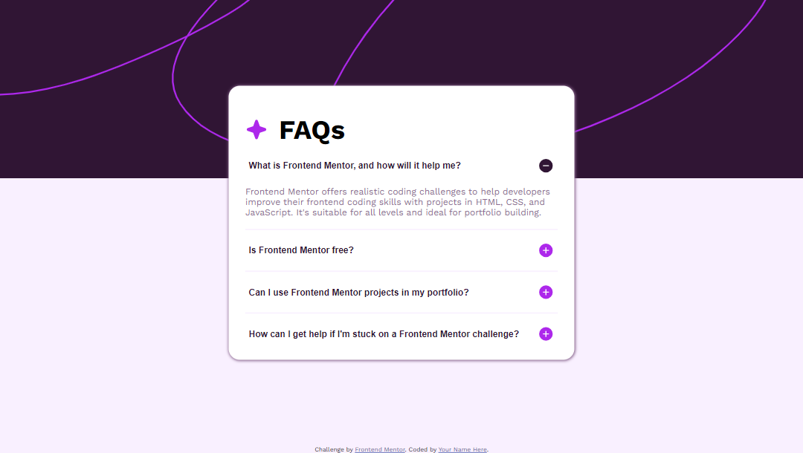
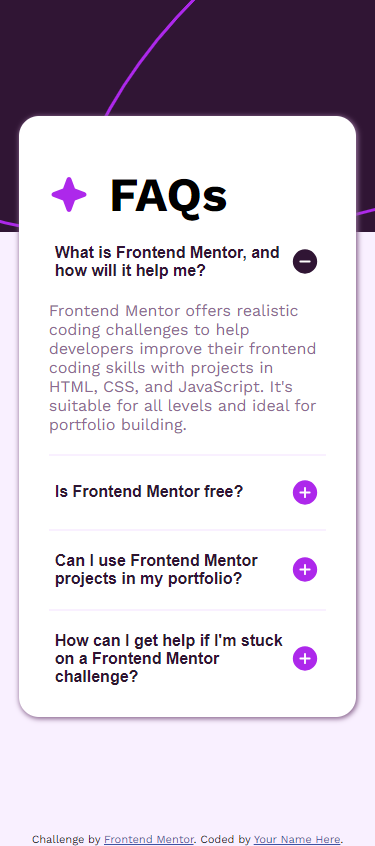
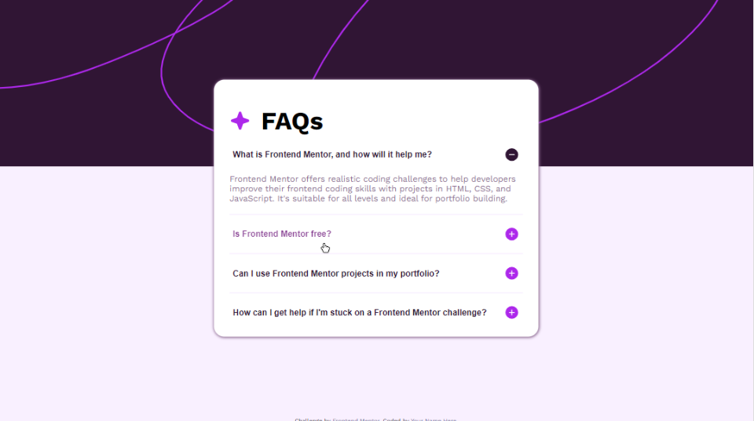

# Frontend Mentor - FAQ accordion solution

This is a solution to the [FAQ accordion challenge on Frontend Mentor](https://www.frontendmentor.io/challenges/faq-accordion-wyfFdeBwBz). Frontend Mentor challenges help you improve your coding skills by building realistic projects.

## Table of contents

- [Overview](#overview)
  - [The challenge](#the-challenge)
  - [Screenshot](#screenshot)
  - [Links](#links)
- [My process](#my-process)
  - [Built with](#built-with)
  - [What I learned](#what-i-learned)
  - [Continued development](#continued-development)
  - [Useful resources](#useful-resources)
- [Author](#author)

## Overview

### The challenge

Users should be able to:

- Hide/Show the answer to a question when the question is clicked
- Navigate the questions and hide/show answers using keyboard navigation alone
- View the optimal layout for the interface depending on their device's screen size
- See hover and focus states for all interactive elements on the page

### Screenshot

#### Dekstop Preview



#### Mobile Preview



#### Hover Preview



### Links

- Solution URL: [Github](https://github.com/MuhRandy/faq-accordion-main-frontendmentor)
- Live Site URL: [Github Pages](https://muhrandy.github.io/faq-accordion-main-frontendmentor/)

## My process

### Built with

- Semantic HTML5 markup
- CSS custom properties
- Flexbox
- Responsive

### What I learned

This is what I learn while doing this challenge.

#### CSS Background Shorthand

The CSS background have many properties that are used to add background effects for elements. In my case I use this:

```css
body {
  background: var(--light-pink) url("../images/background-pattern-desktop.svg") no-repeat
    top;
}
```

CSS above is shorthand of this:

```css
body {
  background-color: var(--light-pink);
  background-image: url("../images/background-pattern-desktop.svg");
  background-repeat: no-repeat;
  background-position: top;
}
```

When using background shorthand property, the order of the property values is:

```css
    background-color
    background-image
    background-repeat
    background-attachment
    background-position
```

It does not matter if one of the property values is missing, as long as the other ones are in this order.

#### Hover Effect to Child Element While Hover Parent Element

Before knowing this I make the children covering whole parent. So when hovering parent, what actually we hover is the child. But with using this methode:

```css
.parent:hover .child {
  color: red;
}
```

we don't need to make chile covering whole parent. It will change the child when you hovering the parent. In my case I using like this:

```css
/* sectionHeading is the parent of question of FAQs and plus or minus icon */
.sectionHeading:hover h2 {
  filter: brightness(280%);
}
```

#### Keyboard Event Listener and Focusable Element

I need this so the user can navigate thorough the Questions. First on FAQs question I am using div to wrap it. My idea was to focus on it when user press the arrow up or arrow down on keyboard. First I need to test it on browser console like this:

```js
// get the element div on section
const section = document.getElementsByTagName("section")[0];
const sectionDiv = section.getElementsByTagName("div")[0];

// when user press keydown
document.addEventListener("keydown", (event) => {
  if (event.key === "ArrowUp" || event.key === "ArrowDown") {
    sectionDiv.focus();
  }
});
```

But nothing happened when I press up or down on keyboard. Turn out the isn't the focusable element. This is what the focusable element is if they are not disabled:

- input
- select
- textarea
- button
- object
- Anchors are focusable if they have an href or tabindex attribute
- Area elements are focusable if they are inside a named map, have an href attribute, and there is a visible image using the map.

Because of that I need to change my div to button, and it work it can be focusable. This is what I use to make user can navigate using keyboard.

```js
const sections = document.getElementsByTagName("section");
const buttons = document.getElementsByTagName("button");

let i = -1;

document.addEventListener("keydown", (event) => {
  i = navigateWithArrowKeyboard(buttons, event, i);

  buttons[i].focus();
});

function navigateWithArrowKeyboard(elements, event, i) {
  const lastElementIndex = elements.length - 1;

  switch (event.key) {
    case "ArrowDown":
      if (i === -1 || i === lastElementIndex) {
        return (i = 0);
      } else {
        return (i += 1);
      }

    case "ArrowUp":
      if (i === -1 || i === 0) {
        return (i = lastElementIndex);
      } else {
        return (i -= 1);
      }

    default:
      return i;
  }
}
```

### Continued development

I want when user navigate the accordion will show and when move to the next accordion, the accordion will hidden and the next will open. When user click when the focused accordion will be closed and the clicked open.

### Useful resources

- [W3School](https://www.w3schools.com/) - This helped me for almost anything, just like the documentation of HTML, CSS, and javascript.
- [Stack Overflow](https://stackoverflow.com/) - This is an amazing forum where you can ask or find someone with similiar problem you have that already solved.

## Author

- Website - [Muhammad Randy](https://mrandy-portfolio.web.app/)
- Frontend Mentor - [@MuhRandy](https://www.frontendmentor.io/profile/MuhRandy)
- Twitter - [@RandyThz](https://twitter.com/RandyThz)
